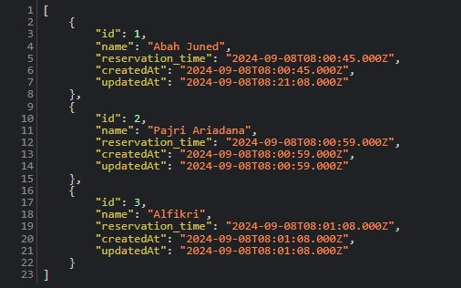
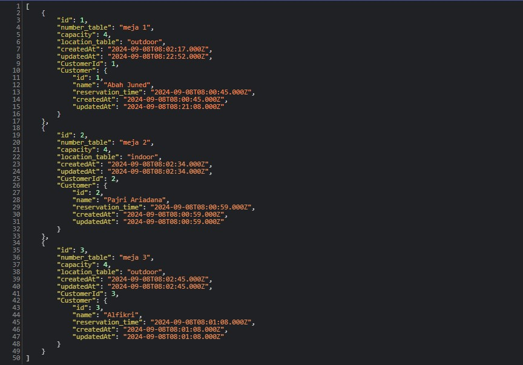
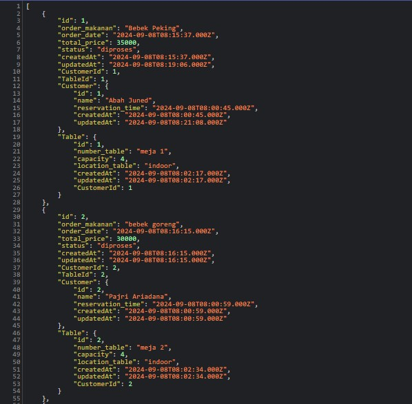
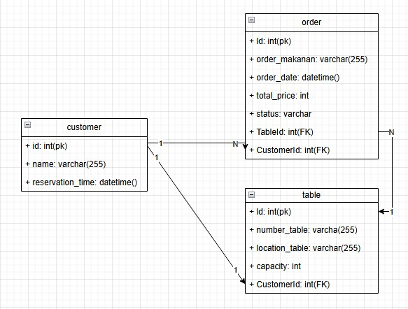
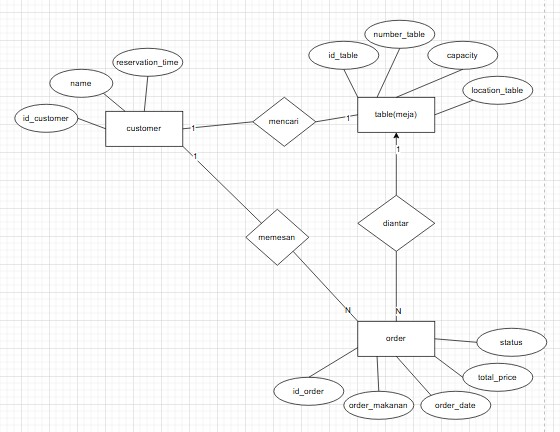

# CASE PROJECT
management restaurant yang berfungsi untuk memanage sebuah customer, order, dan table(meja)

# DESKRIPSI CASE
dalam project ini memiliki 3 Entitas utama yang berhubungan satu sama lain :
1.Meja (Table): Meja yang tersedia di restoran.
2.Pelanggan (Customer): Pelanggan yang memesan meja.
3.Pesanan (Order): Pesanan makanan dan minuman yang dibuat oleh pelanggan.

# RELASI ANTAR ENTITAS
1.Meja ke Pelanggan: Setiap meja bisa dipesan oleh satu pelanggan, tetapi tidak setiap waktu.
    Relasi: One-to-One

2.Pelanggan ke Pesanan: Setiap pelanggan bisa membuat beberapa pesanan.
    Relasi: One-to-Many

3.Pesanan ke Meja: Setiap pesanan terkait dengan satu meja yang dipesan oleh pelanggan.
    Relasi: Many-to-One

PROJECT INI DIBUAT UNTUK TUGAS BACKEND EXPRESS JS MENGGUNAKAN ORM SEQUELIZE DAN SISTEM CRUD

# HASIL DARI DB YANG DIBUAT

### CUSTOMER

### TABLE(MEJA)

### ORDER

# UML

# COPYRIGHT BY © cirss_
real inima, soalnya gada forked from-nya rekkk😂😹😹😹