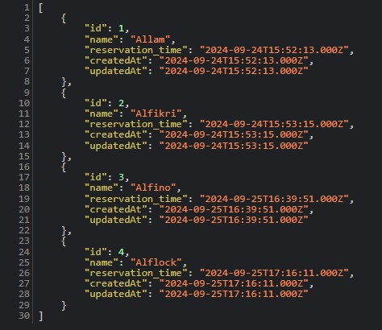
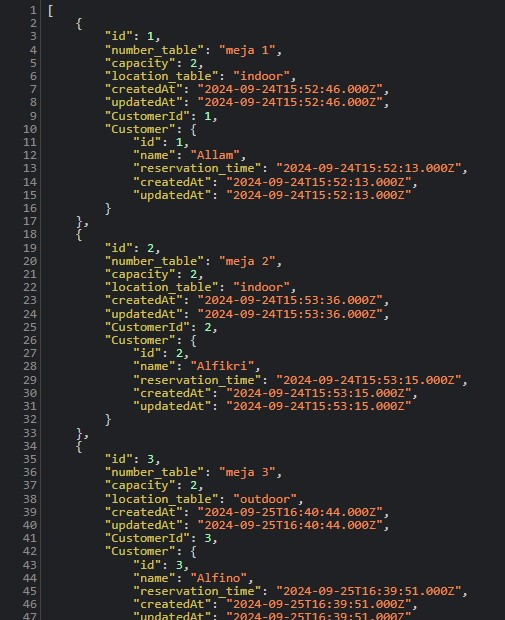
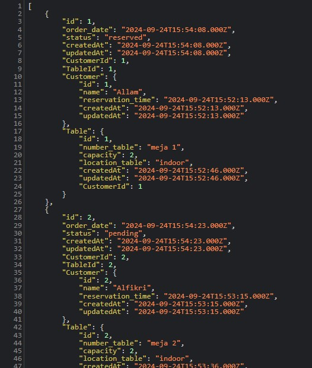
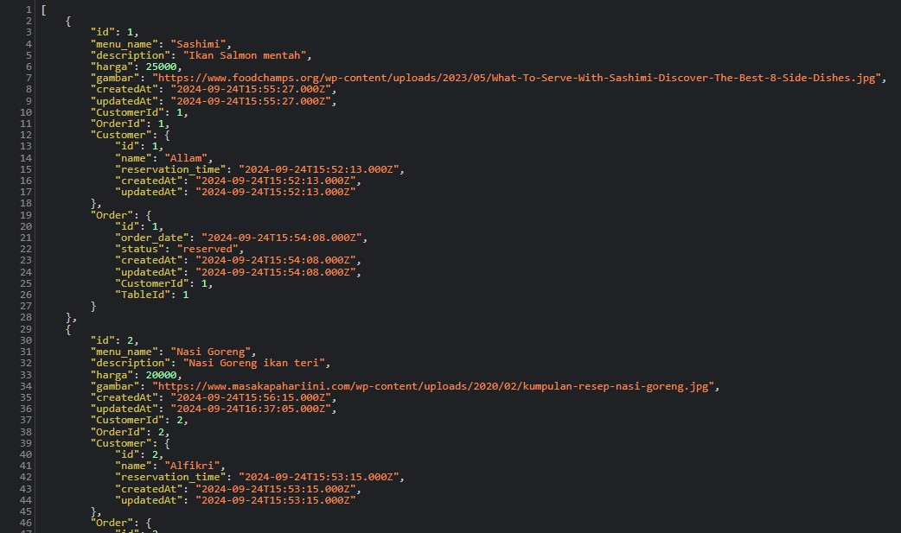
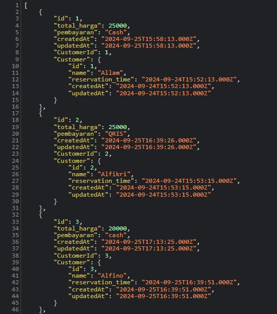
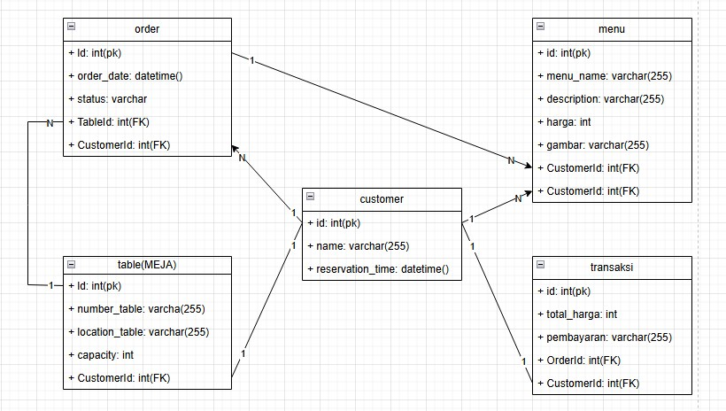
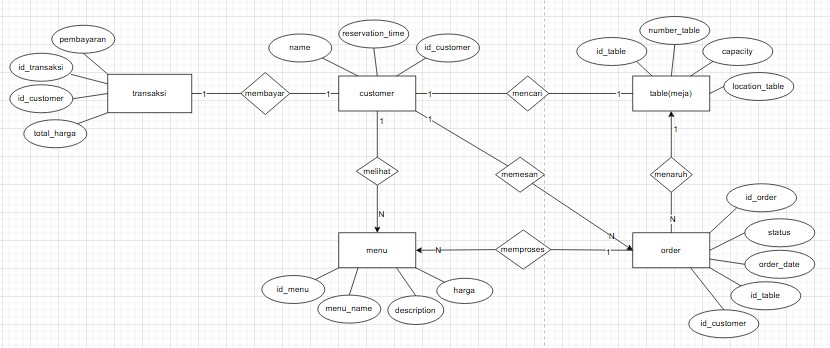

# CASE PROJECT
management restaurant yang berfungsi untuk memanage sebuah customer, order, transaksi, menu dan table(meja)

# DESKRIPSI CASE
dalam project ini memiliki 3 Entitas utama yang berhubungan satu sama lain :
1.Meja (Table): Meja yang tersedia di restoran.
2.Pelanggan (Customer): Pelanggan yang memesan meja.
3.Menu: Menu makanan dan minuman yang dipilih oleh pelanggan.
4.Pesanan (Order): Pesanan makanan dan minuman yang diorder oleh pelanggan.
5.Transaksi (Pembayaran): Transaksi yang dilakukan pelanggan.

# RELASI ANTAR ENTITAS
1.Meja ke Pelanggan: Setiap meja bisa dipesan oleh satu pelanggan, tetapi tidak setiap waktu.
    Relasi: One-to-One

2.Pelanggan ke Menu : Setiap pelanggan bisa melihat beberapa menu untuk dipesan.
    Relasi: One-to-Many

3.Pelanggan ke Pesanan(Order) : Customer dapat memesan banyak Orderan
    Relasi: One-to-Many

4.Pesanan(Order) ke Menu: Dalam satu kali pesanan dapat memesan banyak menu.
    Relasi: One-to-Many

5.Pesanan(Order) ke Meja: Banyaknya setiap pesanan terkait dengan satu meja yang dipesan oleh pelanggan.
    Relasi: Many-to-One

6.Pesanan(Order) ke Customer: Banyaknya setiap pesanan terkait dengan satu pelanggan.
    Relasi: Many-to-One

7.Customer ke Transaksi: Setiap customer wajib membayar atau melakukan transaksi pesanan yang di pesan.
    Relasi: One-to-One
    

PROJECT INI DIBUAT UNTUK TUGAS BACKEND EXPRESS JS MENGGUNAKAN ORM SEQUELIZE DAN SISTEM CRUD

# HASIL DARI DB YANG DIBUAT

### CUSTOMER

### TABLE(MEJA)

### ORDER

### MENU

### TRANSAKSI

# UML

# COPYRIGHT BY © cirss_